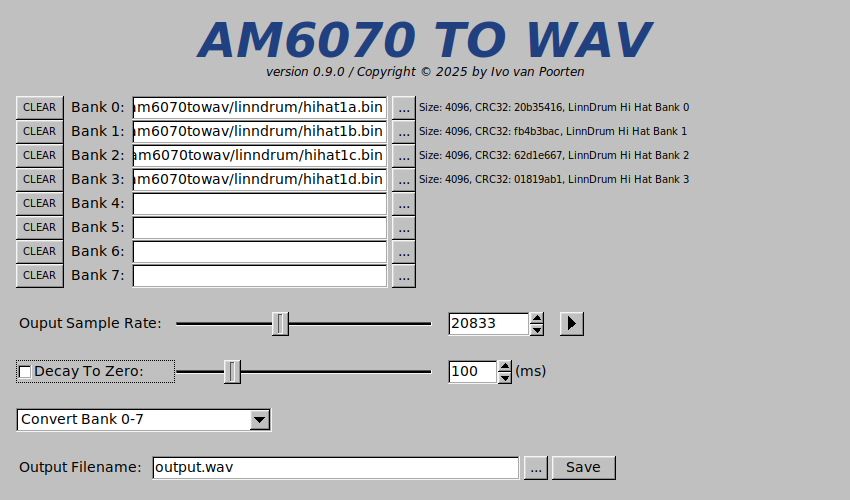

# AM6070TOWAV

With this program you can convert ROM dumps from old drum machines that used the _am6070_ Companding D-to-A Converter.
It can be used both as a GUI application, and as a command line utility for batch conversion.
Included is a database that detects most of the well known sample banks of the Linn drum machines, the Emu Drumulator, and Oberheim's DX and DMX.

## Installation

Download one of the [binary releases](https://github.com/ivop/am6070towav/releases), or compile from source if you're comfortable doing that.
You'll need FLTK 1.3 or later, libSDL 2.x, and a C++ compiler.
To build, type ```make```.
On Windows, use MSYS and type ```make STATIC=-static```.

## GUI



You can load up to 8 ROM images at once.
Especially the older machines, like the Linn LM-1, had their samples split over several ROMs.
Load them in order and use the default conversion type.

Newer machines had larger EPROMs and sometimes had multiple samples in one EPROM.
You can select a different conversion type to only convert part of the ROM.

Note that there is no postprocessing and no resampling being done.
The resulting WAV file has the _exact_ sample rate you specify with the tuning slider, and uses 16-bit signed integer samples.
It's up to you or your DAW to do proper resampling to, for example, 24-bit 96kHz.
If you click the play button to preview the current settings, the resampling is either done by libSDL or by your audio backend.
That's not necessarily the best quality, but it has no effect on the final WAV file.

Some drum machine did not have separate samples for closed and open hi-hats.
For convenience there's an optional decay filter that will allow you to shorten the hats.

## Command Line

When used as a command line utility, you can specify the following command line options, which all mimic the GUI equivalents:

```
usage: am6070towav [options] input.rom [input.rom]*

   Run without arguments to start the GUI version.

   When using the command line version, you can specify up to eight ROMs.

   -h              print this help message
   -o filename     output filename [default: output.wav]
   -r rate         output sample rate [default: 20833]
   -d time         decay to zero in [0-500] ms [default: off]
   -t type         type of conversion [default: all banks]
                       0 - Convert Bank 0-7
                       1 - Convert Bank 0 Only
                       2 - Convert Bank 0, first 50%
                       3 - Convert Bank 0, second 50%
                       4 - Convert Bank 0, first 25%
                       5 - Convert Bank 0, second 25%
                       6 - Convert Bank 0, third 25%
                       7 - Convert Bank 0, fourth 25%
                       8 - Convert Bank 0, first 75%
                       9 - Convert Bank 0, last 75%
```

This can be useful if you want to do batch conversion of several ROMs, or want a bunch of different tunings.
For example:

```
for i in `seq 10000 1000 30000` ; do
    am6070towav -r $i -o clap-$i.wav clp1.bin clp2.bin
done
```
